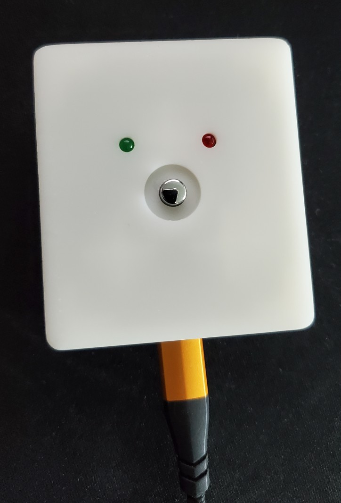
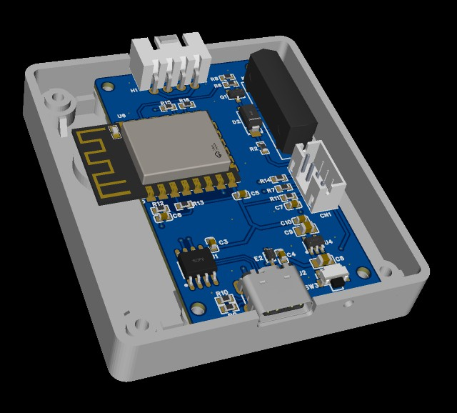

# Wol
### English | Chinese
This is an ESP8266 module Wake on LAN box, 3D printed shell. | 这是一个使用ESP8266模组制作的WOL小装置，使用3D打印的外壳。

## Feature | 特性
 - Web service          |  Web方式控制
 - Physical button      |  物理按键控制
 - Magic pack wake      |  魔术包方式开机
 - Physical switch wake |  物理接通方式开机

## TODO
 - Serial terminal               |  串口终端开发
 - Target PC power state detect  |  目标PC开机状态检测

## Credits
 - PlatformIO
 - a7md0/WakeOnLan
 - paulstoffregen/Time
 - mathertel/OneButton
